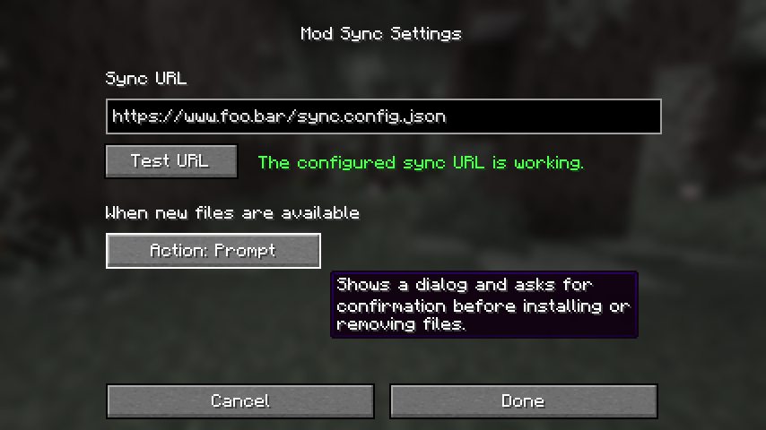

## What is it

Mod Sync is a mod that will automatically make sure that you always have the latest mods that are needed to play on your friend's server.

It is intended for non-technical people that have difficulty navigating the mess that is the world of Minecraft modding and for people that just can't be bothered to always keep up with installing the latest mods every time they log on to their friend's server.

## How does it work

When you launch Minecraft the mod will download a list of required files from a previously configured URL and make sure you have all the files on that list. If any files are found to be missing, the mod will download and install the files automatically for you.

The list of required files is maintained by the server admin, so if he installs a new mod on the server, he would add that mod to the list of files and the next time you launch the game, it will automatically install that new mod.

## Installation

Just put the mod's .jar file in the `mods` directory of your Minecraft instance. If you have been given an accompanying `modsync.json` config file by the server admin, you can just put that into the mods directory as well.

If you have not been given a `modsync.json` config file by your server admin, you will need to go to the mod's settings and configure the URL of the file list manually.



The settings screen also allows you to configure what should happen when the mod detects that new files are available for download:

The default option is to always show a confirmation prompt and ask you for permission before installing or removing any files. The other options are to silently perform changes automatically or to always reject them which all but disables the mod.

## A word of caution

This mod effectively allows the person that maintains the online file list to have arbitrary mods and files downloaded to your computer.

And while this mod prevents files from being downloaded to locations that are outside of your Minecraft directory and while it will ask you (unless configured differently) for confirmation before performing any changes, please note that every Minecraft mod that you install can potentially be malicious.

**Only ever use this mod in a setting where you thoroughly and completely trust the server admin.**

## The Sync Config

**This section is of interest to server admins only.**

The `Sync Config` (or *file list* as called above) is the configuration file that determines which files should be downloaded or removed by clients when they launch the game.

You need to upload this file to a publically accessible location and then provide the URL to your friends and have them configure it in the mod's setting screen. Alternatively, to make your life easier, you may just want to put it in a `modsync.json` config and give that to your friends instead like so:

```js
{
  "url": "https://www.foo.bar/sync.config.json"
}
```

This config can either be placed into the `config` directory or also simply into the `mods` directory, in which case `Mod Sync` will automatically move it to the `config` directory the next time it runs.

### Installing files

The `Sync Config` is a plain-text *JSON* file and a simple file may look like this:

```js
{
  "install": {
    "mods": [
      "https://www.foo.bar/some-mod.jar",
      "https://www.qux.baz/another-mod.jar"
    ]
  }
}
```

The above file would check for the existance of the files `some-mod.jar` and `another-mod.jar` in the user's `mods` directory and download them if they don't exist.

Note that the *"mods"* key in the above example is just the name of a directory relative to the Minecraft base directory. If you wanted to download, say, a texturepack or some config files into the `config/foo-mod` directory, you would do it like this:

```js
{
  "install": {
    "mods": [
      "https://www.foo.bar/some-mod.jar",
      "https://www.qux.baz/another-mod.jar"
    ],

    "texturepacks" [
      "https://www.foo.bar/my-texturepack.jar"
    ],

    "config/foomod" [
      "https://www.foo.bar/some-config.json",
      "https://www.foo.bar/another-config.json"
    ]
  }
}
```

### Removing files

In addition to installing files, you can also add instructions to remove files from a user's installation. This can be useful if you want to replace an existing mod with a newer version.

Let's say the user already has the mod `foobar-1.2.3.jar` installed and you now wish to upgrade it to the new version `foobar-2.3.4.jar`. You can instruct `Mod Sync` to remove the old `foobar-1.2.3.jar` file and install the new `foobar-2.3.4.jar` file like this:

```js
{
  "install": {
    "mods": [
      "https://www.foo.bar/foobar-2.3.4.jar",
    ]
  },

  "remove": [
    "mods/foobar-1.2.3.jar"
  ]
}
```

Removal entries support glob pattern matching (i.e. asterisk wildcards) so the above entry could also be written as `mods/foobar*` which would remove any file in the `mods` directory that starts with `foobar`.

Note that files listed under the `install` key are exempt from this, so in the above example the `foobar-2.3.4.jar` would _not_ be deleted by our removal rule.


### More Advanced Configurations

#### Base URL

If alot of your mods will be downloaded from the same host, you can define a `baseUrl` property in your `Sync Config` and then use relative paths instead of full Urls:

```js
{
  "install": {
    "baseUrl": "https://www.foo.bar/minecraft/mods",

    "mods": [
      "some-mod.jar",
      "some-other-mod.jar",

      "https://www.qux.baz/mod-from-somewhere-else.jar"
    ]
  }
}
```

The `some-mod.jar` and `some-other-mod.jar` files above will be downloaded from `https://www.foo.bar/minecraft/mods/some-mod.jar` and `https://www.foo.bar/minecraft/mods/some-other-mod.jar`, respectively.

The last entry will be unaffected by this because it is not a relative path.

#### Renaming Files

Sometimes you may need to save a downloaded file under a different name. Let's say you have the remote file `https://www.foo.bar/some-mod.jar` and you want to download it as `foobar-mod.jar` instead. The `Sync Config` for this would look like this:

```js
{
  "install": {
    "mods": [
      {
        "url": "https://www.foo.bar/some-mod.jar",
        "name": "foobar-mod.jar"
      }
    ]
  }
}
```

Instead of a simple `string` our entry now is an object literal with the `url` key pointing to the download URL and the `name` key denoting the name the file will be downloaded as.

#### Verifying Files

If a user already has a file that is listed in the `Sync Config` it will usually simply be skipped.

If you want to make sure that the user's existing file is identical to the one listed in your `Sync Config`, you can provide a *SHA-1* file hash that the user's existing file will be compared against. If there is a mismatch, the user's local file will be overwritten with the remote file.

Let's take a look at an example:

```js
{
  "install": {
    "mods": [
      {
        "url": "https://www.foo.bar/some-mod.jar",
        "sha1": "b61777cf12b7ba40f75d79429a833f40a9b80719"
      }
    ]
  }
}
```

Again, instead of a `string` our entry now is an object literal with an additional `sha1` key that contains the `SHA-1` hash of the file pointed to by `url`.

> To compute the SHA-1 of a file, there's usually a utility already provided with your operating system that can do that.
> 
> Windows comes with the `certutil.exe` utility that allows you to compute the SHA-1 hash of a given file. You can run it from a command-prompt like this:
>
> *certutil -hashFile path-to-your-file*
>
> Under Linux you can use the `sha1sum` utility and you would simply run it in a terminal window like this:
> 
> *./sha1sum path-to-your-file*

### Validating your Sync Config

Writing JSON by hand can be pretty tedious and error prone. A missing quotation mark here or a little extra comma there will immediately result in your whole `Sync Config` no longer working!

I suggest just quickly running your config through an online validator such as [this one](https://jsonlint.com/) before uploading it to your server to save yourself some trouble.
